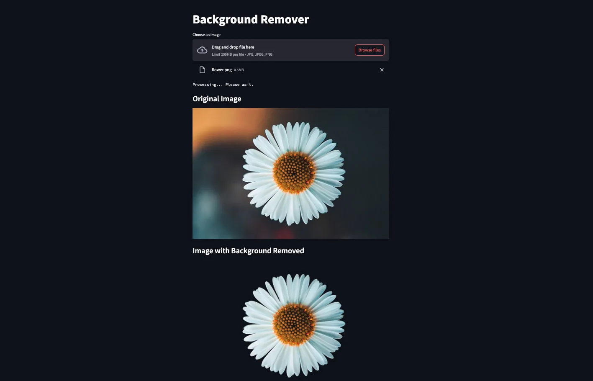

# This is a simple back ground remover for my students.  This is useful for makeing sprites you might need when making computer games.

1 - upload a n image perferaly with white background.
2 - This app will remove the backgound and return an the image as a png file.
